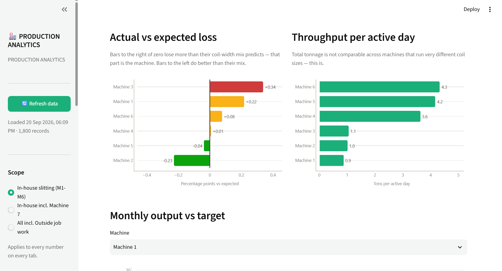
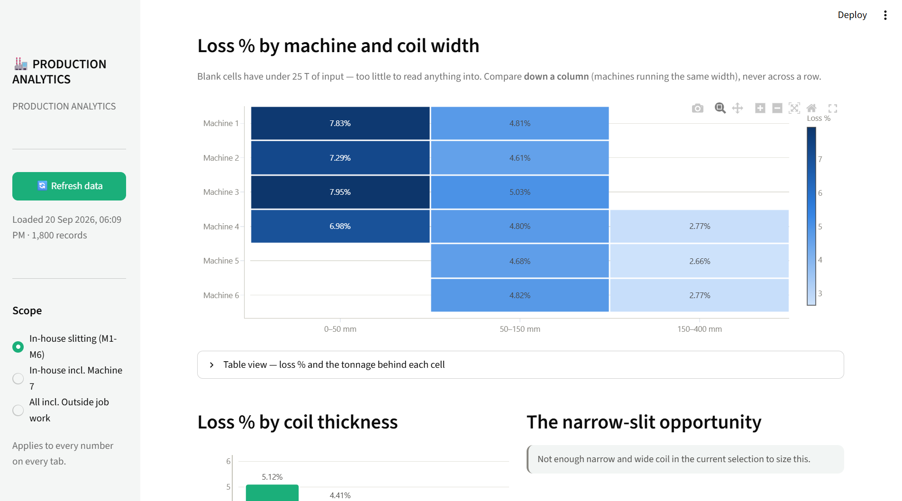
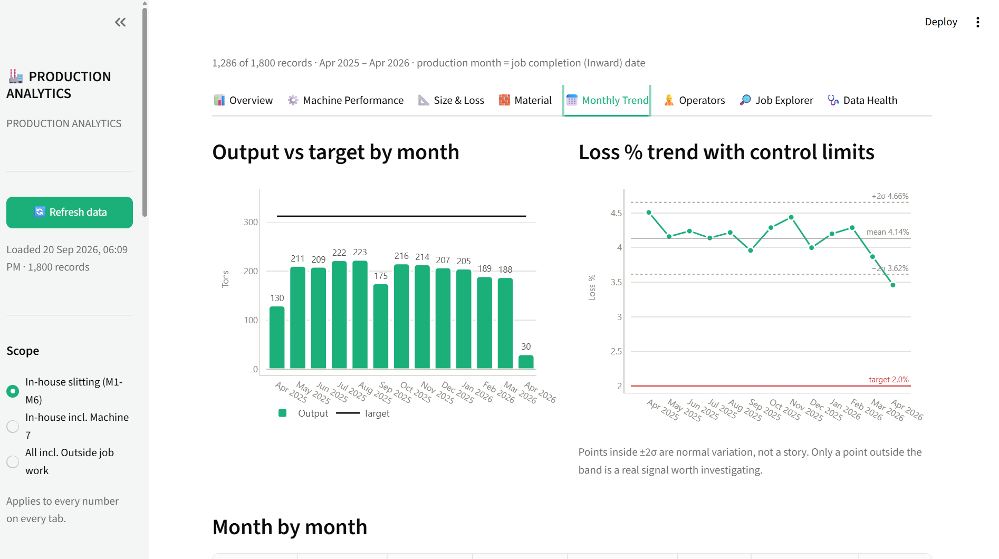
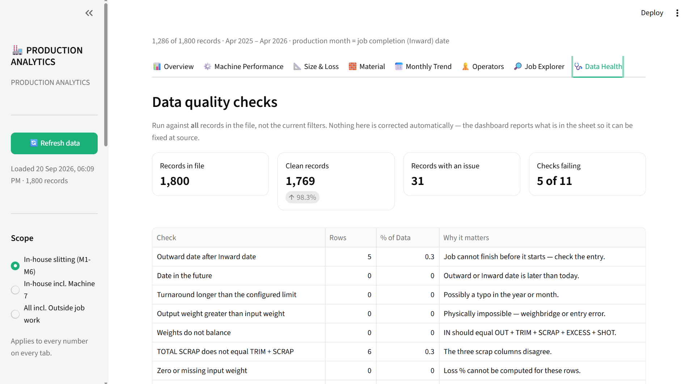

# Production analytics for a coil slitting plant

A Streamlit dashboard over a plant's daily slitting register, covering output
against target, material loss, coil-size effects, turnaround and data quality.

Built for a steel and non-ferrous coil slitting operation running seven in-house
machines plus outside job work, where production was tracked in Excel and loss
was reviewed by eye.

Kaushik Rodpalkar · [LinkedIn](https://www.linkedin.com/in/kaushik-rodpalkar-2297042b5) · rodpalkarkaushik@gmail.com

---

## The question

Slitting loses material at the edge of every coil. The plant knew its overall
loss rate and could see that some machines looked worse than others. The
standing assumption was that the weak machines were the problem.

The dashboard was built to answer one question properly: **which machine is
genuinely underperforming, and which is only running harder material?**
## How the scope arrived at that question

The original request was narrower. The CEO wanted the monthly production
summary — until then compiled by hand — produced consistently, so the first
version was a machine-wise and month-wise view in Excel.

That version was reviewed by the Business Development head, whose response
reframed the brief: a monthly total per machine does not explain anything, and
the number worth understanding is scrap. The second round therefore had to reach
material and coil-size level, which the hand-compiled process had never done and
which the raw register could not support without cleaning first.

Two things followed from that review. The analysis moved from reporting output
to explaining loss, and the deliverable moved from a summary to a tool the
business could interrogate itself. The width-mix finding below only surfaced
because the scope widened at that second step.

## The answer

Almost none of the apparent difference between machines is the machine.

Edge trim removes a roughly fixed width from a coil, so on a 30 mm strip it
consumes a far larger share of the input than on a 1200 mm strip. A machine that
runs narrow work will always post a high headline loss without being badly run.

Comparing raw loss between machines therefore compares the material, not the
operation. Once each machine's loss is measured against what the plant-wide rate
would predict *for the width mix that machine actually processed*, the spread
between machines nearly disappears.

On the included sample dataset the raw spread between machines is **5.53
percentage points**, and adjusting for width mix collapses it to **0.69 pp**.
The live plant data behaves the same way. Loss falls from **7.9%** in the
narrowest width band to **1.4%** in the widest.

The operational consequence is that loss is not reduced by pressuring machines.
It is reduced by changing what runs narrow, which is a planning decision rather
than a shop-floor one.

*Loss %, Expected Loss % and Loss Gap per machine. The Gap column is the machine; the rest is material mix.*





## How the comparison works

The Machine Summary reports three columns per machine:

| Column | Meaning |
|---|---|
| Loss % | what actually happened |
| Expected Loss % | this machine's loss at the plant-wide rate for each width band, given the width mix it actually ran |
| Loss Gap | actual minus expected |

**The Loss Gap is the machine. Everything else is the material mix.**

## Measurement decisions

**Loss % replaced Yield %.** Output ÷ Input sits at 99.8–100.0% for every
machine, because scrap and trimming are not deducted from `SLITTING OUT WT`.
That ratio is a flat line by construction and cannot separate a good month from
a bad one. Everything now uses `TOTAL SCRAP ÷ SLITTING IN`, which ranges from
roughly 1% to 8% and reconciles with the `PERCENTAGE(%)` column already in the
register, so the dashboard and the shop-floor sheet agree.

**Loss is tonnage-weighted, never a mean of per-job percentages.** A 40 kg coil
at 30% loss must not carry the same weight as a 200-ton coil at 1%. On the
sample data the weighted rate is 2.6% against an unweighted mean of 4.2% — the
unweighted figure is dominated by small jobs.

**Low-volume cells are suppressed, not shown faint.** A machine or width band
below 25 tons of input cannot generate a written conclusion or a heatmap cell.
Without that guard a three-ton sample produces headline claims.

**Month-to-month movement is read against a ±2σ band.** Points inside the band
are normal variation. Reacting to every monthly wobble is the most common way to
spend a shift chasing noise.

**Outside job work is reported but never given a target,** and job-work vendors
are held out of operator comparisons, since comparing an in-house operator to a
subcontracting firm measures nothing.

**Production month is the Inward date, not the Outward date.** Outward is when
material was sent to the machine; Inward is when it came back. Turnaround is the
difference, and any row where Outward falls after Inward is reported as an error
rather than silently producing a negative duration.

## Tabs

| Tab | What it answers |
|---|---|
| Overview | Where the period stands, and what stands out |
| Machine Performance | Which machine is genuinely weak, after adjusting for what it runs |
| Size & Loss | Why loss happens, and what closing the gap is worth |
| Material | Which metals move volume and which lose material |
| Monthly Trend | Whether anything is changing, or it is normal variation |
| Operators | In-house operator output, held separate from job-work vendors |
| Job Explorer | Find a coil; see the worst individual jobs |
| Data Health | What is wrong in the register, so it can be fixed at source |

Every table has a CSV download. Every chart has a table twin or direct labels,
so no value is reachable only by hovering.

## Data quality

The register is hand-typed, so the dashboard reports its faults rather than
absorbing them. The Data Health tab counts rows where the mass balance
`IN = OUT + TRIM + SCRAP + EXCESS + SHOT` does not hold, `TOTAL SCRAP` does not
equal `TRIM + SCRAP`, the size string cannot be parsed, a coil number repeats,
dates are reversed, turnaround exceeds a plausible limit, material type is
neither FG nor RM, or a grade matched no grouping rule.

Grade variants are collapsed by anchored patterns — `CRC IS 513`, `CRC AISI
1008` and `CRC ST2K60` all become `CRC`. A grade matching no rule is reported
rather than quietly becoming its own category, so a new metal shows up as a
question instead of a silent extra row on every chart.

## Running it

```bash
pip install -r requirements.txt
python make_sample_data.py     # writes a synthetic Production_Report.xlsx
streamlit run app.py
```

Opens at http://localhost:8501. Data does not auto-refresh; save the workbook
and press **Refresh data** in the sidebar.

`python validate.py` checks the maths without launching the dashboard — it
verifies the weighting, the target arithmetic, the size-mix adjustment, the
suppression guard and the scope reconciliation in a few seconds.

## Sample data

The plant's own register is not published. `make_sample_data.py` writes a
stand-in with the same 23 columns and the same structural relationships: loss
falling with coil width, machines running different width mixes, a small true
machine effect, and a scatter of realistic data-entry faults so the Data Health
tab has something to report. Figures produced from it are illustrative, not
plant figures.

## Structure

| File | What it is |
|---|---|
| `app.py` | Layout and charts only |
| `datalayer.py` | Reading, cleaning, normalising, quality flagging, metric maths |
| `config.json` | Targets, bands, scopes, vendor and alias lists |
| `validate.py` | Checks the numbers without launching the app |
| `make_sample_data.py` | Generates the synthetic register |

The split is deliberate: changing a target or a width band is a `config.json`
edit, and verifying the maths is one command. Neither requires touching chart
code.

## Stack

Python (pandas), Streamlit, Plotly, openpyxl.

## Limitations

- Loss is measured in tons, not rupees. No grade-level material cost is
  available, so the size analysis quantifies tonnage recovered rather than
  margin recovered.
- Machine downtime is not recorded in the register, so a low-output machine
  cannot be separated into "idle" and "slow".
- Target achievement covers only machines carrying a committed daily target;
  outside job work is excluded from that denominator by design.
